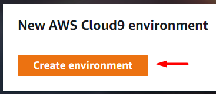

# Aufgabe 1: IAM User & Cloud9

## 1) IAM User erstellen

**‼️ Achtung: Dieser Schritt ist nur für Teilnehmer mit persönlichem Account ‼️**

In IAM (AWS Konsole -> Services -> IAM):
- Bentzer -> Benutzer erstellen

Schritt 1:
- Name: ich (oder was anderes)
- Zugriffstyp: Zugriffsschlüssel und Passwort
- Konsolenpasswort: Benutzerdefiniert, Passwort eingeben
- Zurücksetzen ... erfordern: nein

Schritt 2:
- Vorhandene Richtlinien direkt anfügen
- Richtlinien:
  - PowerUserAccess
  - IAMReadOnlyAccess
  - IAMSelfManageServiceSpecificCredentials
  - IAMUserSSHKeys
  - IAMUserChangePassword
- Weiter, Weiter, Benutzer erstellen

Oben rechts: Benutzerdropdown öffnen
- Accountnummer notieren
- Logout

Neu einloggen als IAM User
- Account ID eintragen
- User: Name aus Schritt 1
- Passwort
- Login

## 2) AWS CLoud9 einrichten

1. Cloud9 öffnen (AWS Konsole -> Services -> Cloud9)

2. Neue Umgebung erstellen ("Create Environment")

3. Name auf "aws-kurs" setzen und bestätigen

4. Im nächsten Schritt alle Einstellungen lassen und weiter klicken

5. Noch einmal alle Einstellungen prüfen und Umgebung erstellen

**:hourglass: 6. Warten bis Umgebung läuft**

7. Auf "Clone from Github" klicken (rechts im Welcome-Dialog)

8. `https://github.com/dswd-cc/aws-kurs.git` hinten an Befehl anhängen, [Enter] drücken

