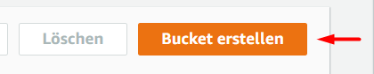
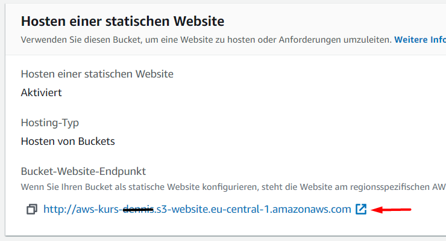

# Aufgabe 2: Galerie auf S3 hosten

## 1) Bucket in S3 erstellen

1. Service "S3" öffnen


2. Neuen Bucket erstellen



3. Bucketname eingeben. **‼️ Achtung: Der Bucketname muss weltweit eindeutig sein ‼️**


4. Öffentlichen Zugriff generell erlauben damit das Webhosting funktioniert


5. Bucket erstellen


6. Bucket in der Übersicht auswählen


## 2) Statisches Hosting aktivieren

1. Reiter "Eigenschaften" öffnen


2. Statisches Hosting aktivieren. Als Indexdokument `index.html` eintragen.


## 3) Bucketrichtlinie erstellen

1. Reiter Berechtigungen öffnen


2. Bucketrichtlinie bearbeiten


Folgenden Text eintragen:

```json
{
  "Version":"2012-10-17",
  "Statement":[
    {
      "Sid":"PublicRead",
      "Effect":"Allow",
      "Principal": "*",
      "Action":["s3:GetObject","s3:GetObjectVersion"],
      "Resource":["arn:aws:s3:::DOC-EXAMPLE-BUCKET/*"]
    }
  ]
}
```

**‼️ Achtung: Der Bucketname muss in das Feld Ressource anstelle von "DOC-EXAMPLE-BUCKET" eingetragen werden ‼️**


3. Änderungen speichern


## 4) Webseite hochladen

1. Reiter Objekte öffnen


2. Auf "Hochladen" klicken


3. Dateien aus dem Verzeichnis `Aufgabe 2/web` herunterladen und per Drag&Drop hochladen.


4. "Hochladen" klicken


5. Warten bis der Upload erfolgt ist


## 5) Webseite öffnen

1. Reiter "Eigenschaften" öffnen


2. URL unter "Statisches Hosting" im Browser öffnen



Nun sollte die App angezeigt werden.


Nach einem Klick auf ein Thumbnail öffet sich das Bild in der Großansicht 


## 5) Weitere Fotos einbinden (optional)

1. Weitere Fotos hochladen (z.B. von https://unsplash.com/)

2. Cloud9 öffnen

3. Index.html in Cloud9 öffnen


4. Liste der Fotos anpassen (**Achtung: Groß/Kleinschreibung beachten**)


5. Geänderte Index.html in S3 Bucket hochladen, z.B. so:


