# Aufgabe 3: Galerie Backend mit EC2 und PHP

## 1) Schlüsselpaar erstellen und in Cloud9 einbinden

1. Service "EC2" öffnen

2. Links "Schlüsselpaare" auswählen

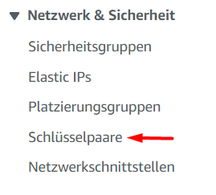

3. Schlüsselpaar erstellen

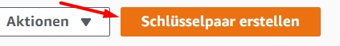

4. Name (`aws-kurs`) und Format (PEM) eintragen

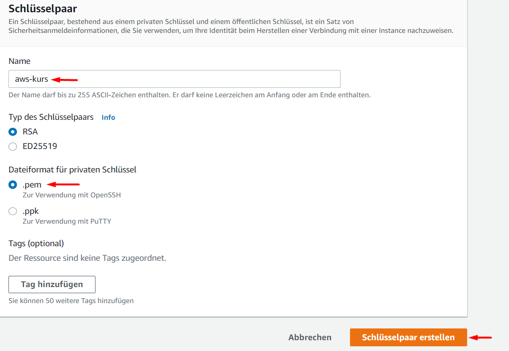

5. Schlüsselpaar als PEM-Datei speichern

6. Datei in Cloud9 in `environment` per Drag&Drop hochladen (Oberstes Verzeichnis)

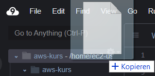

7. Terminal öffnen und `chmod 600 aws-kurs.pem` eingeben ([ENTER] drücken)

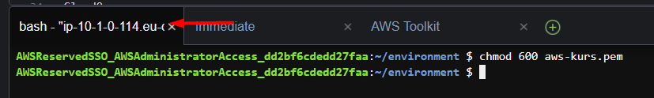

## 2) Sicherheitsgruppe für NFS erstellen

1. Im EC2 Menü "Sicherheitsgruppen" wählen

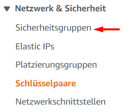

2. "Sicherheitsgruppe erstellen" wählen

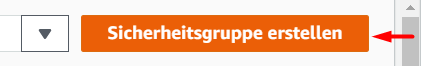

3. Name (`nfs`) und Beschreibung (`NFS Zugriff`) eintragen

4. Regeln für **eingehenden** Datenverkehr eintragen
  - Typ: "NFS", Quelle: "Anywhere-IPv4"
  - Typ: "NFS", Quelle: "Anywhere-IPv6"

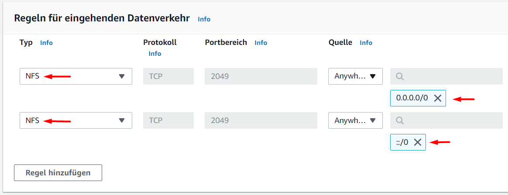

5. Regel anlegen

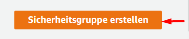

## 3) EFS Speicher erstellen

1. Service "EFS" öffnen

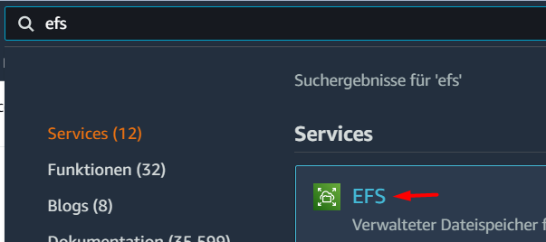

2. Neues Dateisystem erstellen

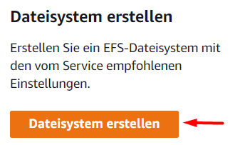

3. Name (`aws-kurs-code`) setzen

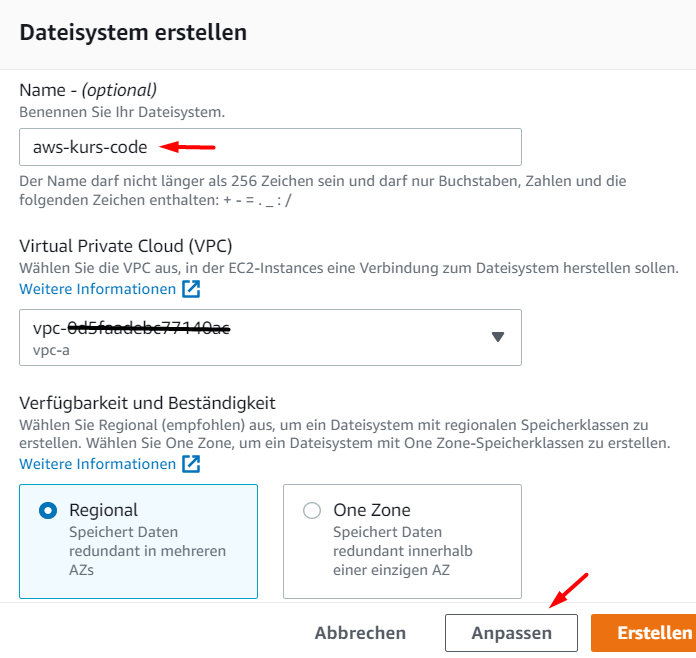

4. "Weiter klicken"

5. Für alle Availability Zones die Sicherheitsgruppe `nfs` hinzufügen. (**Achtung: Die Gruppe `default` muss bleiben**)

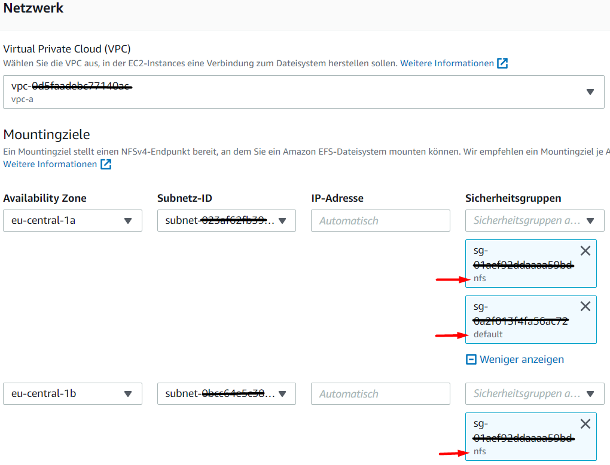

6. 2x "Weiter" klicken und dann "Erstellen" klicken

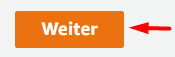

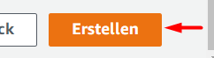

## 4) Dateisystem in Cloud9 einbinden

1. Dateisystem `aws-kurs-code` öffnen

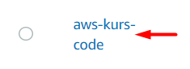

2. Reiter "Netzwerk" öffnen und warten bis Status = "Verfügbar"

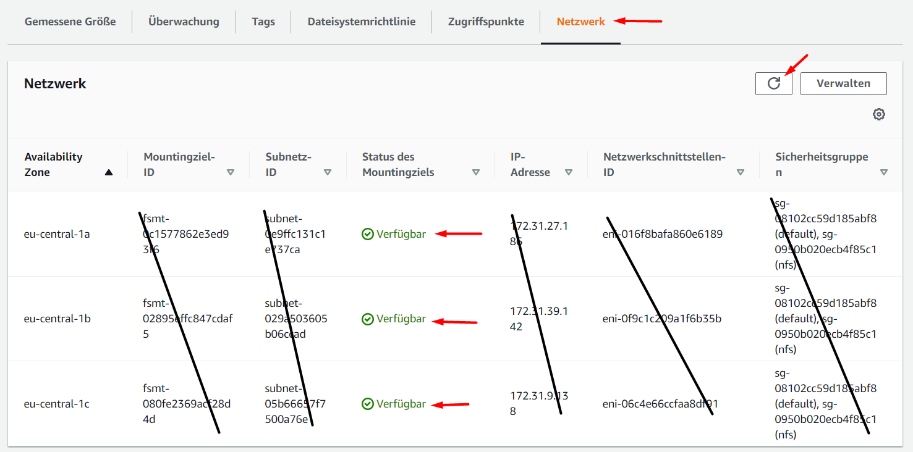

3. Auf "Anfügen" klicken

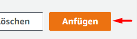

4. Unteren Befehl kopieren

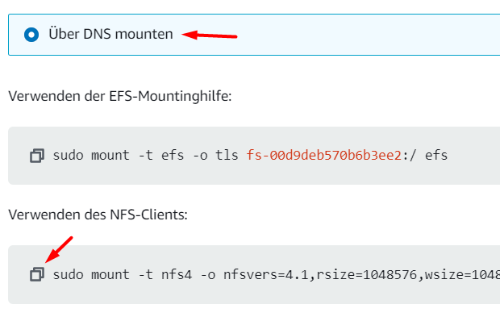

5. In Cloud9: Neues Verzeichnis `efs` im Hauptverzeichnis erstellen

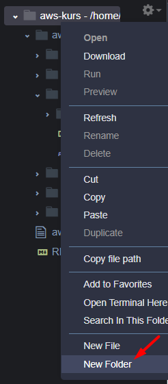

6. Kopierten Befehl im Terminal eingeben

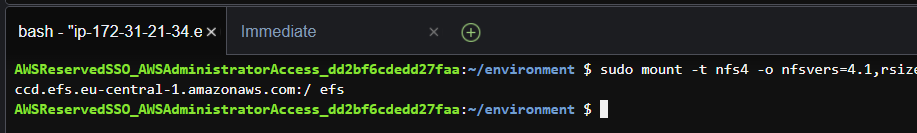

7. Berechtigung setzen: `sudo chmod 777 efs` im Terminal eingeben ([ENTER] danach)

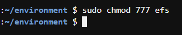

## 3) EC2 Instanz erstellen

EC2 -> Instanzen -> Instanz starten

Schritt 1
- AMI: Amazon Linux 2

Schritt 2
- Instance-Typ: t2.micro

Schritt 3
- "aws-kurs-code" Dateisystem hinzufügen, Mountpunkt: /var/www/html

Schritt 4: weiter

Schritt 5:
- Labels: Name: aws-kurs-backend

Schritt 6:
- Name: aws-kurs-backend
- HTTP erlauben

Fertig, Starten
- Schlüsselpaar "aws-kurs" auswählen

Warten bis verfügbar
Private IP von EC2 Instanz kopieren

## 4) Webserver einrichten

In Cloud9:
- code nach efs rüberkopieren
- Neues Terminal öffnen (Ctrl-T)
- `ssh -i aws-kurs.pem PRIVATE-IP` ausführen, mit "yes" bestätigen

Im gleichen Terminal (SSH auf dem Backend)
- `sudo yum install -y httpd php`
- `sudo service httpd start`
- `sudo chmod 777 /var/www/html/pictures`

In EC2 die "öffentliche IP" des Backends kopieren

Im Browser:
- http://PUBLIC-IP/test.php aufrufen (Achtung: HTTP statt HTTPS)
