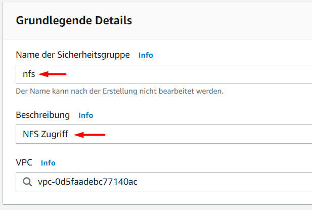
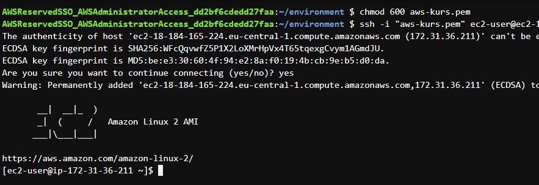
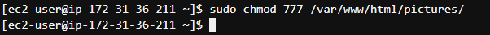

# Aufgabe 3: Galerie Backend mit EC2 und PHP


## 1) Schlüsselpaar erstellen und in Cloud9 einbinden

1. Service "EC2" öffnen


2. Links "Schlüsselpaare" auswählen


3. Schlüsselpaar erstellen


4. Name (`aws-kurs`) und Format (PEM) eintragen


5. Schlüsselpaar als PEM-Datei speichern

6. Datei in Cloud9 in `environment` per Drag&Drop hochladen (Oberstes Verzeichnis)


7. Terminal öffnen und `chmod 600 aws-kurs.pem` eingeben ([ENTER] drücken)


## 2) Sicherheitsgruppe für NFS erstellen

1. Im EC2 Menü "Sicherheitsgruppen" wählen


2. "Sicherheitsgruppe erstellen" wählen


3. Name (`nfs`) und Beschreibung (`NFS Zugriff`) eintragen



4. Regeln für **eingehenden** Datenverkehr eintragen
  - Typ: "NFS", Quelle: "Anywhere-IPv4"
  - Typ: "NFS", Quelle: "Anywhere-IPv6"


5. Regel anlegen


## 3) EFS Speicher erstellen

1. Service "EFS" öffnen


2. Neues Dateisystem erstellen


3. Name (`aws-kurs-code`) setzen


4. "Weiter klicken"


5. Für alle Availability Zones die Sicherheitsgruppe `nfs` hinzufügen. (**Achtung: Die Gruppe `default` muss bleiben**)


6. 2x "Weiter" klicken und dann "Erstellen" klicken


## 4) Dateisystem in Cloud9 einbinden

1. Dateisystem `aws-kurs-code` öffnen


2. Reiter "Netzwerk" öffnen und warten bis Status = "Verfügbar"


3. Auf "Anfügen" klicken


4. Unteren Befehl kopieren


5. In Cloud9: Neues Verzeichnis `efs` im Hauptverzeichnis erstellen


6. Kopierten Befehl im Terminal eingeben


7. Berechtigung setzen: `sudo chmod 777 efs` im Terminal eingeben ([ENTER] danach)


## 5) EC2 Instanz erstellen

1. Service "EC2" öffnen


2. "Instances" im linken Menü wählen


3. "Instances starten" anklicken


4. Im Schritt 1 "Amazon Linux 2" wählen


5. In Schritt 2 "t2.micro" asl Instanztyp wählen


6. Das EFS Volume `aws-kurs-code` als Speicher hinzufügen. **Pfad auf `/var/www/html` ändern**


7. Namens-Tag `aws-kurs-backend` hinzufügen


8. Eine neue Sicherheitsgruppe anlegen (Name: `aws-kurs-backend`, Beschreibung: `AWS Kurs Backend`) und als neue Regel HTTP erlauben


9. Instanz starten


10. Schlüsselpaar `aws-kurs` auswählen und bestätigen


## 6) Webserver einrichten

1. Warten bis Instanz "Läuft". Danach auf "verbinden" klicken.


2. Reiter "SSH Client" öffnen und unteren Beispielbefehl kopieren.


3. In Cloud9 im Terminal den kopierten Befehl eingeben ([ENTER] drücken). Nachfrage mit "yes" und [ENTER] bestätigen.



4. In der SSH Verbindung die folgenden 3 Befehle eingeben und jeweils mit [ENTER] bestätigen.

```
sudo yum install -y httpd php
sudo service httpd start
sudo chmod 777 /var/www/html/pictures
```




5. Den Inhalt von `Aufgabe 3/code` kopieren und nach `efs` kopieren (Achtung: zuerst `efs` markieren und dann Rechtsklick darauf zum Einfügen).


## 7) App im Browser öffnen

1. Öffentliche IP in EC2 kopieren


2. Neuen Browsertab öffnen und "http://" und die kopierte IP eingeben


In der App können nun Bilder hochgeladen (nur .jpeg) und angesehen werden.


